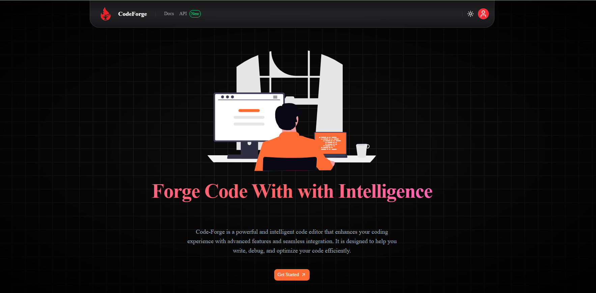
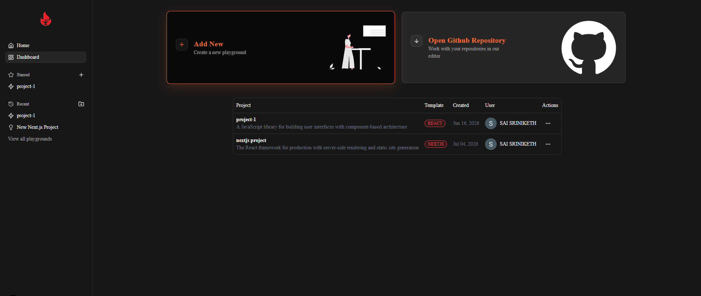
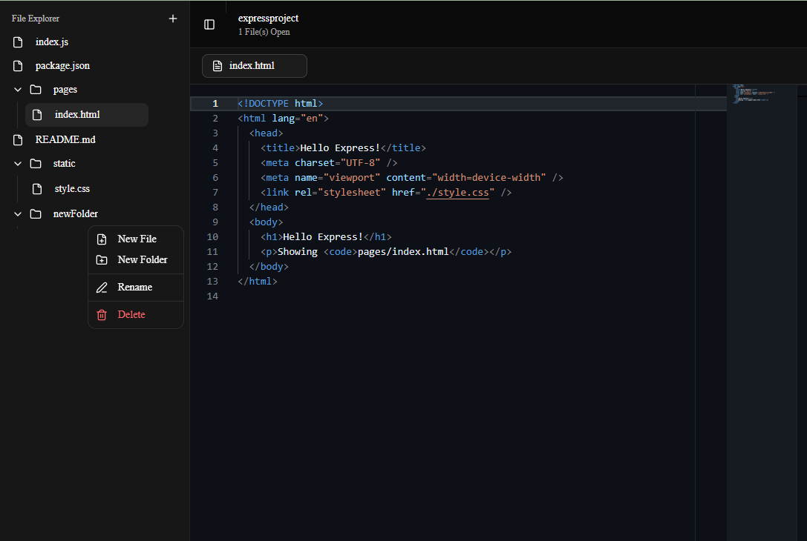
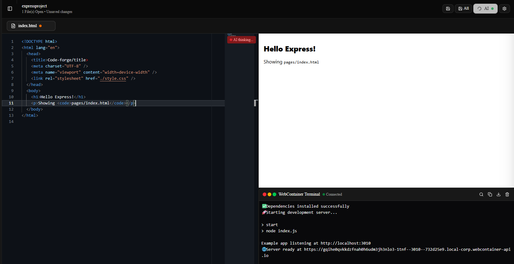
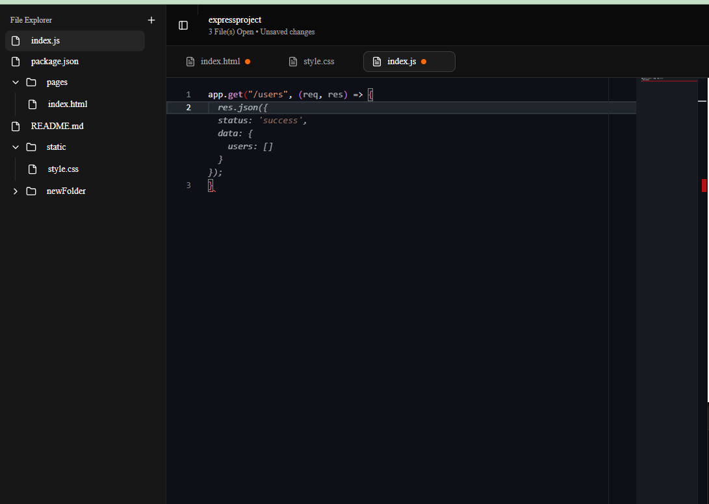
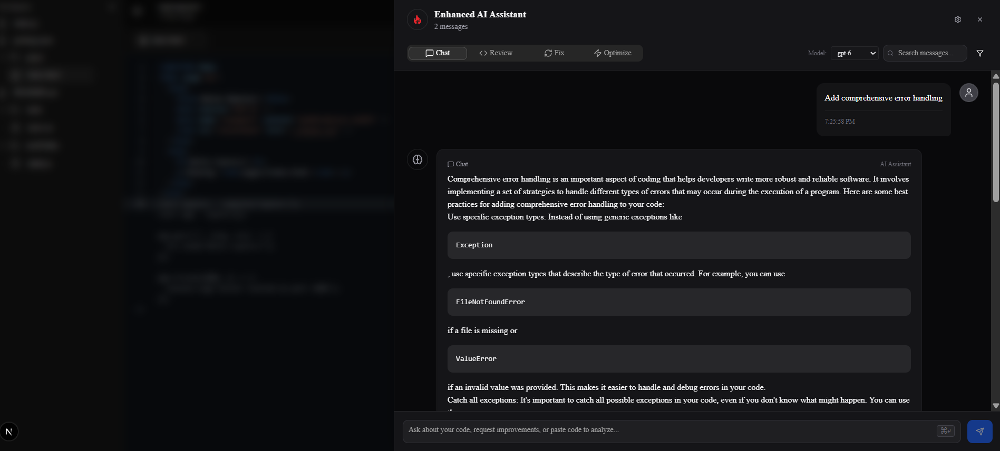

<h1 align="center">⚒️ Code Forge</h1>

<p align="center">
  <strong>AI-Native Browser IDE with Intelligent Code Assistance and Containerized Execution</strong>
</p>

<p align="center">
  Intelligent Code Assistance • Inline Suggestions • Containerized Execution
</p>

<p align="center">
  
  
  
  
  
</p>

---

## ✨ Overview

Code Forge is a browser-based AI-powered development environment inspired by modern IDEs such as VS Code.

The platform combines intelligent coding assistance, real-time inline code completion, multi-file project management, and containerized code execution to deliver a seamless developer experience directly in the browser.

---

## 🌟 Key Features

### 🤖 AI Coding Assistant

* Context-aware coding help
* Bug detection and debugging support
* Code explanation and optimization
* Interactive conversational interface

### ⚡ Inline AI Suggestions

* Ghost-text completions
* Real-time code prediction
* Monaco Editor integration

### 📁 Multi-File Workspace

* File explorer
* Create, rename and delete files
* Persistent workspace structure

### 🖥️ Browser-Based Runtime

* Powered by WebContainers
* Secure isolated execution
* Integrated terminal support

### 🎨 IDE Experience

* Monaco Editor
* Syntax highlighting
* Resizable panels
* Modern responsive UI

---

# 📸 Screenshots

## 🚀 Landing Page

The landing page introduces Code Forge and highlights its AI-powered development experience, modern UI, and seamless browser-based workflow.



---

## 📊 Dashboard

The central workspace where developers can create projects, manage files, and access coding tools.



---

## 📁 Workspace & File Explorer

Multi-file project management with an intuitive file explorer for organizing and navigating project structures.



---

## 💻 Code Playground

A Monaco Editor-powered coding environment featuring syntax highlighting, intelligent editing capabilities, and a responsive developer experience.



---

## ⚡ AI Inline Suggestions

Real-time AI-powered code completions provide contextual suggestions directly within the editor to improve productivity and reduce development time.



---

## 🤖 AI Chat Assistant

An integrated AI assistant capable of explaining code, debugging issues, generating solutions, and answering development-related queries.



---


# 🏗️ System Architecture

```text
User Browser
      │
      ▼
┌─────────────────┐
│ Monaco Editor   │
└───────┬─────────┘
        │
        ├──────────────► AI Assistant
        │                    │
        │                    ▼
        │                 Ollama
        │
        ▼
WebContainer Runtime
        │
        ▼
Terminal Output
```

---

# ⚙️ Tech Stack

<p align="center">
  
</p>

<p align="center">
  
</p>

### Frontend

* Next.js
* React
* TypeScript
* Tailwind CSS

### Editor

* Monaco Editor

### AI Layer

* Ollama
* Local LLM Models

### Runtime

* WebContainers
* Node.js

---

# 📂 Project Structure

```bash
src
├── app
├── components
├── hooks
├── lib
├── services
├── store
├── types
└── utils
```

---

# 🚀 Getting Started

## Clone Repository

```bash
git clone https://github.com/your-username/code-forge.git
```

## Install Dependencies

```bash
npm install
```

## Start Ollama

```bash
ollama serve
```

## Pull Model

```bash
ollama pull codellama
```

## Start Development Server

```bash
npm run dev
```

---

# 🎯 Engineering Challenges Solved

* Browser-based IDE architecture
* AI-assisted coding workflows
* Real-time inline completions
* Containerized code execution
* Multi-file workspace management
* Monaco Editor customization
* Context-aware AI prompting

---

# 🔮 Future Enhancements

* Git Integration
* Collaborative Coding
* Cloud Workspace Persistence
* AI Test Generation
* AI Refactoring Tools
* Multi-Language Runtime Support

---

# 👨‍💻 Author

**Sai Sriniketh Kode**

Passionate about Full Stack Development, Developer Tooling, AI Applications and Software Engineering.

If you found this project interesting, consider giving it a ⭐.

The easiest way to deploy your Next.js app is to use the [Vercel Platform](https://vercel.com/new?utm_medium=default-template&filter=next.js&utm_source=create-next-app&utm_campaign=create-next-app-readme) from the creators of Next.js.

Check out our [Next.js deployment documentation](https://nextjs.org/docs/app/building-your-application/deploying) for more details.
